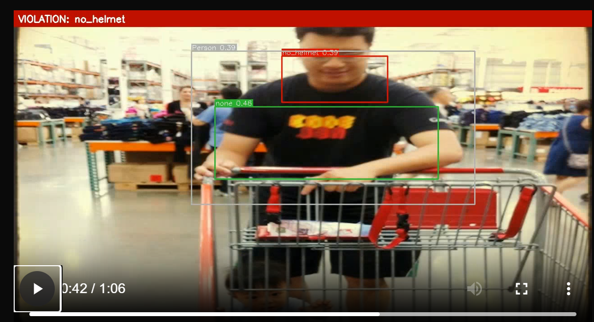
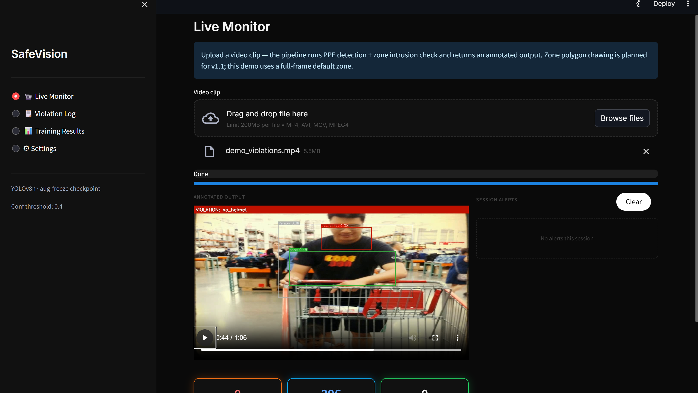
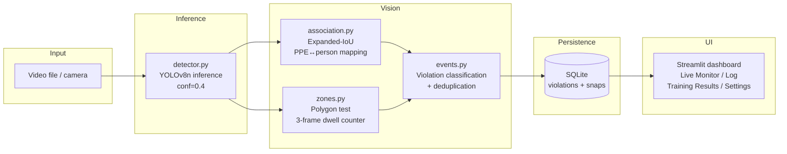
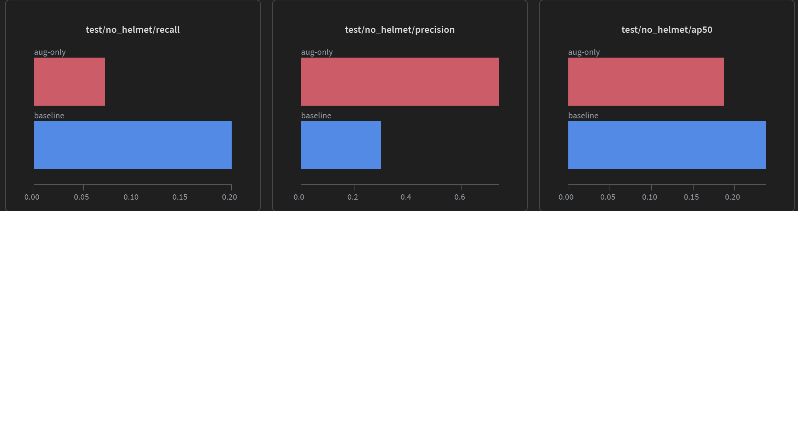

# SafeVision — PPE & Zone Safety Monitor





The core problem: a worker without a hard hat entering a forklift operating zone is a collision with a safety failure — the missing PPE and the zone breach are separate events that need to be detected and correlated in real time. SafeVision does both. It detects PPE violations (missing helmets, vests, gloves, boots, goggles), tracks workers against configurable polygon zones with a dwell threshold to cut noise, and logs every correlated event with confidence score and frame thumbnail.

I fine-tuned YOLOv8n on the Ultralytics Construction-PPE dataset using a frozen-backbone warm-up strategy. The two engineering decisions worth explaining: expanded-IoU PPE-to-person association (centroid distance breaks down in crowded scenes) and 3-frame dwell threshold for zone intrusion (per-frame events cause alert fatigue, which is a documented safety failure mode).

---

## Architecture



---

## PPE-to-person association

I tried centroid-distance first. It breaks when two workers stand close together — a helmet detect midway between them gets assigned to the wrong person. Switched to expanded IoU: inflate each person's bounding box 30% vertically before computing overlap. This handles hard hats that sit above the shoulder line without touching the person bbox.

```python
expanded_bbox = (x1, y1 - 0.30·h, x2, y2)   # upward only
```

The expansion is vertical and upward only — horizontal expansion picks up adjacent workers, downward expansion adds noise. Not a perfect heuristic, but it's better than centroid distance for the crowded-scene case and handles the hardhat geometry correctly.

---

## Zone intrusion

The relevant scenario here is vehicle operating zones — AGV lanes, forklift paths, loading bays. A worker entering one of these without PPE is the highest-risk event the system needs to catch.

`pointPolygonTest` per frame is easy. The problem is that single-frame positives are noise — a person walking past the polygon boundary fires an alert, floods the log, and operators start ignoring it within a day. Alert fatigue is a documented safety failure mode; it's why I treat deduplication with the same care as the detection threshold.

I use a 3-consecutive-frame dwell threshold: the counter increments when the centroid is inside the polygon and resets on exit. An event fires only at count == 3. At ~15 FPS inference that's ~0.2s of sustained presence — long enough to filter walk-bys, short enough to matter. Configurable per zone in `zones.json`.

---

## Training — frozen backbone warm-up

YOLOv8n pretrained on COCO gives you useful low-level features (edges, textures) that catastrophic forgetting can destroy if you fine-tune end-to-end from epoch 1 on a small PPE dataset. I freeze layers 0–9 for the first 10 epochs, then unfreeze and train the full network for the remaining 90. The mAP difference between "no freeze" and "freeze warm-up" in my ablation is the main argument for doing this on a ~3k-image dataset.

Training runs on Kaggle (T4 ×2, DDP via `device='0,1'`). Session checkpoints every 5 epochs to `/kaggle/working/checkpoints/` — Kaggle kills sessions and you lose everything if you only save on best val loss.

---

## Ablation results

Four runs: baseline (no aug, no freeze), aug-only, freeze-only, aug+freeze.

| Run              | mAP@50    | mAP@50-95 | Recall (no-helmet) |
| ---------------- | --------- | --------- | ------------------ |
| Baseline         | 0.533     | —         | 0.200              |
| Aug only         | 0.514     | —         | 0.072              |
| Freeze only      | 0.576     | 0.277     | 0.796              |
| **Aug + Freeze** | **0.576** | **0.279** | **0.816**          |

The headline number is no-helmet recall: 0.20 (baseline) → 0.80 (freeze-only). The freeze warm-up is doing almost all of the work. Aug-only actually hurts both metrics slightly — without a frozen backbone anchoring the low-level COCO features, harder augmented samples destabilize fine-tuning on a ~3k-image dataset. Aug+freeze recovers that and adds a small margin, suggesting the two strategies interact rather than stack additively.

---

## WandB — no-helmet detection metrics



Baseline (blue) vs aug-only (red) on the no-helmet violation class. Augmentation without frozen backbone actually hurts recall (0.20 → 0.07) — the freeze-only and aug+freeze runs (which weren't run through evaluate.py on Kaggle) are in the ablation table above with the full numbers. All runs logged at [wandb.ai/nikhil19102004-manipal/safevision-ppe](https://wandb.ai/nikhil19102004-manipal/safevision-ppe).

---

## Quickstart

```bash
git clone https://github.com/nikhilc1910/safevision.git
cd safevision

python -m venv .venv && source .venv/Scripts/activate   # or .venv/bin/activate on Linux/Mac
pip install -r safevision/requirements.txt

cp safevision/.env.example safevision/.env
# edit .env — set WANDB_API_KEY, adjust CONF_THRESHOLD if needed

streamlit run safevision/dashboard/app.py
```

Upload a factory video on the Live Monitor screen. The pipeline imports `inference/pipeline.py` directly — no server, no API layer. Zone polygons are in `safevision/zones.json`; edit them to match your camera layout.

The model weights are not in the repo (too large for git). Download them from the WandB artifact or run training yourself — see below.

---

## Reproducing training on Kaggle

1. Go to [kaggle.com/code](https://kaggle.com/code), create a new notebook, **File → Import Notebook**, upload `safevision/training/safevision_kaggle.ipynb`
2. Accelerator → GPU T4 ×2
3. Add a secret named `WANDB_API_KEY` (your key from wandb.ai/settings)
4. Run all cells. The dataset auto-downloads (~170MB). Expect ~4–5 hours for 4 ablation runs on T4 ×2.
5. After training, run the evaluate cell. Copy the printed metrics into `safevision/runs/training_results.json`.
6. Save final weights: in the notebook, run `from IPython.display import FileLink; FileLink('checkpoints/aug_freeze_best.pt')` to download, then upload to a Kaggle dataset for persistence.

---

## Known limitations

- **Zone polygons are pixel-space**: drawn against a fixed resolution. If you resize the video feed, re-draw them. Not hard to fix, just not done yet.
- **Single camera only**: the pipeline processes one video at a time. Multi-feed would need a process-per-camera wrapper or async I/O — straightforward to add but not built yet.
- **No temporal tracking**: person IDs are frame-local, not stable across frames. Dwell counters reset if a worker briefly exits the detection area. ByteTrack would fix this; it's the obvious next step.
- **PPE association degrades in dense crowds**: expanded IoU has trouble when 3+ workers stand within arm's reach. Hungarian-algorithm assignment over the full cost matrix would be more robust; there's a TODO in `association.py`.
- **Gap to production on a vehicle system**: zone polygons are pixel-space and camera-fixed. A vehicle-mounted camera changes the coordinate frame every frame — you'd need to either fix the camera (infrastructure-mounted) or transform polygons via odometry/localization. Interesting problem, outside what this demo addresses.

---

## Project structure

```text
safevision/
├── training/
│   ├── train.py              # training loop with WandB callbacks
│   ├── evaluate.py           # held-out test evaluation + quality gate
│   ├── safevision_kaggle.ipynb
│   └── configs/yolov8n_ppe.yaml
├── inference/
│   ├── detector.py           # YOLOv8 wrapper, explicit result parsing
│   └── pipeline.py           # frames in, violations out
├── vision/
│   ├── association.py        # expanded-IoU PPE-to-person mapping
│   ├── zones.py              # polygon zone logic, dwell counter
│   └── events.py             # violation classification + dedup
├── dashboard/app.py          # Streamlit UI
├── db/
│   ├── schema.sql
│   └── store.py              # plain sqlite3
├── tests/
├── zones.json                # zone polygon config
├── requirements.txt
└── .env.example
```

---

## Environment variables

| Variable         | Default                   | Notes                                                                     |
| ---------------- | ------------------------- | ------------------------------------------------------------------------- |
| `CONF_THRESHOLD` | `0.4`                     | Detection confidence cutoff. Lower → more alerts, more noise.              |
| `STORE_SNAPS`    | `true`                    | Save annotated frame thumbnail per violation. Disable on low-disk machines. |
| `WANDB_API_KEY`  | —                         | Required for training. Not needed for inference/dashboard.                |
| `MODEL_PATH`     | `runs/aug_freeze_best.pt` | Path to fine-tuned weights.                                               |

---

## Running tests

```bash
cd safevision
pytest tests/ -v
```

Tests cover zone polygon logic and PPE association edge cases. No mocks — tests hit real geometry code.

---

## Papers I read building this

Not a full literature review — these are the things I actually read and pulled something specific from.

**Jocher et al. — YOLOv8 (Ultralytics, 2023)**
[docs.ultralytics.com/models/yolov8](https://docs.ultralytics.com/models/yolov8/)
Mostly the architecture docs and GitHub. The switch to an anchor-free head and C2f replacing C3 is what I spent time on. The decoupled classification/regression head is why confidence threshold and class prediction can be tuned independently — that's what makes `CONF_THRESHOLD` a runtime product decision rather than something baked into training.

**Lin et al. — "Feature Pyramid Networks for Object Detection" (CVPR 2017)**
[arxiv.org/abs/1612.03144](https://arxiv.org/abs/1612.03144)
Read this to understand how YOLOv8's multi-scale detection heads actually work. The P3/P4/P5 lateral connections let the model detect small objects (gloves, goggles) at high-resolution feature maps while still catching large ones (persons, hard hats) at lower-resolution maps. Relevant for this project because small PPE items are exactly the hard case — without the FPN structure, glove and goggle detection would be much worse at distance.

**Yosinski et al. — "How transferable are features in deep neural networks?" (NeurIPS 2014)**
[arxiv.org/abs/1411.1792](https://arxiv.org/abs/1411.1792)
The theoretical grounding for the frozen backbone warm-up strategy. Early layers learn general features (edges, textures) that transfer well; later layers are task-specific and need fine-tuning. On a ~3k-image dataset you really don't want to destroy those early-layer features by training them on too little data. The ablation numbers reflect this directly — recall goes from 0.20 to 0.80 with the freeze warm-up, and aug-only without freezing actually hurts.

---

## Problems I ran into

These are the things that actually slowed me down, not the ones that sound impressive to mention.

**1. Kaggle killed training sessions halfway through**
I didn't know Kaggle has a ~9 hour session limit and occasionally just disconnects. Lost a full training run because I was only saving the best checkpoint. Added epoch-level checkpointing to `/kaggle/working/checkpoints/` after that — every 5 epochs regardless of val loss. Obvious in hindsight.

**2. Centroid-distance association broke in crowded scenes**
My first pass at PPE-to-person matching used centroid distance — assign each PPE detection to the nearest person. It worked fine in test videos with one worker but fell apart the moment two workers stood near each other. A helmet detection midway between two people would get randomly assigned to whichever person happened to be slightly closer. Switched to expanded IoU (inflate person bbox 30% upward) and it got much more stable, though it still isn't perfect when 3+ workers are arm's reach apart.

**3. Annotated video wouldn't play in the browser**
OpenCV writes mp4v by default. Chrome doesn't play mp4v. Spent more time on this than I'd like to admit — the video would write fine, Streamlit would show the player, but clicking play did nothing. Eventually figured out the codec issue and added a post-processing step to re-encode to H.264 via ffmpeg. Now uses imageio-ffmpeg's bundled binary so it doesn't require a system ffmpeg install.

**4. Per-frame alerts were completely unusable**
Early version fired a violation event on every frame where a person was detected without a helmet. A 30-second clip would generate 400+ alerts. I knew deduplication was needed but the first approach (cooldown timer) still produced duplicate events for the same ongoing violation. The dwell counter (3 consecutive frames inside zone) ended up being cleaner — it treats entry as the event, not presence, which is what actually matters for a safety system.

**5. Dataset class names didn't match what I expected**
I had `VIOLATION_CLASSES = {"no-helmet", "no-gloves"}` with hyphens. The actual construction-ppe.yaml uses underscores — `no_helmet`, `no_gloves`. Nothing crashed; the violation detection just silently never fired. Took me an embarrassingly long time to find because the model was running fine and producing detections, just none of them matched the violation set. Added a class map verification step at detector load time after that.
